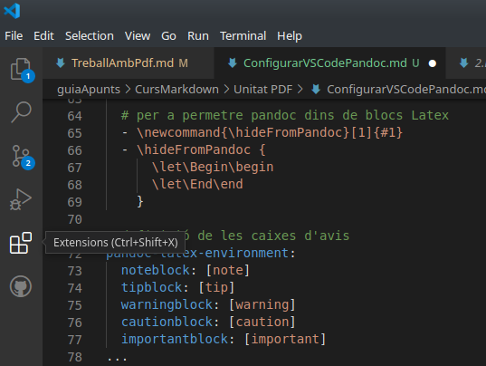
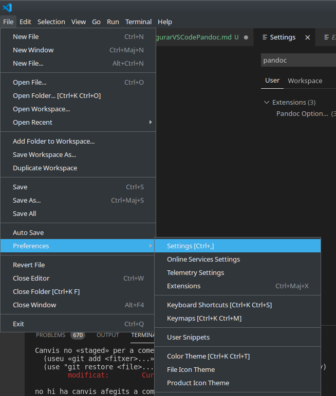
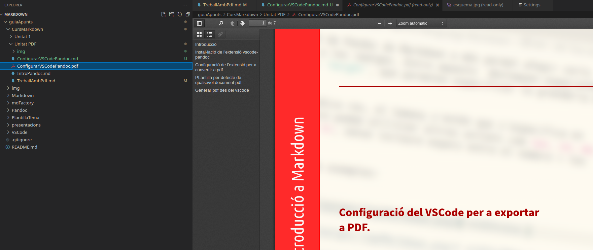

---
# Front matter
# Metainformació del document
title: Configuració del VSCode per a exportar a PDF.  
titlepage: true
subtitle: 
author: 
- Ferran Cunyat
- Joan Gerard Camarena
- Jose Alfredo Murcia
lang: ca

# portada
titlepage-rule-height: 2
titlepage-rule-color: AA0000
titlepage-text-color: AA0000
titlepage-background: ./img/portada.png

# configuració de l'índex
toc-own-page: true
toc-title: Continguts
toc-depth: 2

# capçalera i peu
header-left: \thetitle
header-right: Curs 2021-2022
footer-left: CEFIRE València
footer-right: \thepage/\pageref{LastPage}

# Les figures que apareguen on les definim i centrades
float-placement-figure: H
caption-justification: centering 

# No volem numerar les linies de codi
listings-disable-line-numbers: true

# Configuracions dels paquets de latex
header-includes:

  #  imatges i subfigures
  - \usepackage{graphicx}
  - \usepackage{subfigure}


  #  - \usepackage{adjustbox}
  # marca d'aigua
  - \usepackage{draftwatermark}
 # - \SetWatermarkText{\includegraphics{./img/Markdown.png}}
  - \SetWatermarkText{Per revisar}
  - \SetWatermarkScale{.5}
  - \SetWatermarkAngle{20}
   
  # caixes d'avisos 
  - \usepackage{awesomebox}

  # text en columnes
  - \usepackage{multicol}
  - \setlength{\columnseprule}{1pt}
  - \setlength{\columnsep}{1em}

  # pàgines apaïsades
  - \usepackage{pdflscape}
  
  # per a permetre pandoc dins de blocs Latex
  - \newcommand{\hideFromPandoc}[1]{#1}
  - \hideFromPandoc {
      \let\Begin\begin
      \let\End\end
    }
 
# definició de les caixes d'avis
pandoc-latex-environment:
  noteblock: [note]
  tipblock: [tip]
  warningblock: [warning]
  cautionblock: [caution]
  importantblock: [important]
...

# Introducció

En este docuemnt, s'explica com configurar el *Visual Studio Code* (vscode endavant) per a facilitar la creació d'arxius pdf de forma automàtica. Per fer-ho, heu de completar la lectura dels documents anteriors i haver seguit tot els processos d'instal·lació que allí s'exposen.

# Instal·lació de l'extensió vscode-pandoc

El primer pas serà instal·lar l'extensió vscode-pandoc de l'autor DougFinke. Per tal de fer-ho, sols heu de fer clic a *Extensions*, a la part esquerra del vscode. 

{width=10cm}

Busquem l'extensió **vscode-pandoc** al quadre de busqueda i fem clic a "Install" sobre el mateix resultat de la búsqueda o en la pàgina d'informació de l'extensió, que s'obri en fer clic sobre l'extensió.

{width=10cm}

# Configuració de l'extensió per a convertir a pdf

Una vegada instal·lada l'extensió, sols ens faltarà configurar-la per a generar documents pdf des del mateix vscode en compte de tindre-ho que fer des de la consola.

Anem a *File -> Preferences -> Settings* i busquem la paraula pandoc.

Veureu una caixa d'edició de text que es diu *Pandoc: Pdf Opt String. Ahí haureu d'escriure totes les opcions que vulgau utilitzar des de la línia de comandaments amb pandoc (el -t pdf, per a generar pdf no s'ha de posar).

{width=10cm}

Per exemple, en el meu cas, en aquest quadre de text tinc:

```
--from markdown --template eisvogel --toc --variable urlcolor=cyan --listings -N --pdf-engine xelatex --filter pandoc-latex-environment
```

Una vegada introduïdes les opcions que desitgem, tanquem la finestra de configuració, no cal donar-li abguardar en ningun lloc,ho fa automàticament.

# Plantilla per defecte de qualsevol document pdf

Com haureu vist, una de les opcions de la configuració és *--template*, on li hem indicat que volem utilitzar la plantilla *eisvogel*. Si no la localitza, vos mostrarà un error com a que no l'ha pogut localitzar al generar el pdf. Per tal de que aquesta plantilla la localitze correctament a qualsevol document, l'hem d'ubicar en els directoris per defecte on pandoc va a buscar les plantilles. Per saber quin és eixe directori, ho podeu veure amb l'ordre:

```bash
pandoc --version
```
Veureu una línia com la següent:

```bash
Default user data directory: /home/ferran/.local/share/pandoc or /home/ferran/.pandoc
```

Dins d'eixa ubicació creeu un directori **templates** i poseu l'arxiu eisvogel.latex dins este directori. Ho podeu fer amb les següents ordres a un sistema GNU/Linux:

```bash
mkdir -p ~/.local/share/pandoc/templates
cp "ruta a eisvogel.latex" ~/.local/share/pandoc/templates
```

Per als que no esteu molt familiaritzats amb l'ús de la consola de Linux, el punt d'abans de la carpeta indica que és una carpeta oculta, per tant, si ho voleu fer de forma gràfica (crear la carpeta templates i copiar la plantilla), haureu d'habilitar que vos mostre les carpetes ocultes des del programa gestor d'arxius.

{width=10cm}

# Generar pdf des del vscode

Per últim, sols ens queda generar l'arxiu pdf de forma automàtica des de l'extensió vscode-pandoc. 

Per a això, amb un arxiu markdown obert, pulseu F1 o Ctl + Shift + P, i escriviu Pandoc. Vos ha de mostrar un quadre com el següent, i pulsem Intro. 

{width=10cm}

Seguidament ens demanarà si volem exportar a pdf a html o a docx. Seleccionem pdf i si tot ha anat bé, en uns segons ens generarà el pdf amb el mateix nom d'arxiu que l'arxiu md original. S'obri automàticament al lector de pdf per defecte.

{width=10cm}

Si heu tingut qualsevol error, vscode vos el mostrarà amb informació de quin ha sigut el problema. Els problemes més freqüents amb les seues solucions solen ser:
- No troba la plantilla - Mira que està a la ruta per defecte
- No troba alguna imatge - Comprova la ruta_a_imatge
- Falta instal·lar alguna cosa - Instal·la el paquet que falte

# Visualització de pdf directament amb vscode

Per últim i com a opcional, podeu instal·lar l'extensió **vscode-pdf** de l'autor *tomoki1207* per poder visualitzar els pdf sense ixir del vscode, simplement fent clic a l'arxiu pdf que voleu visualitzar des de l'explorador d'arxius integrat.

