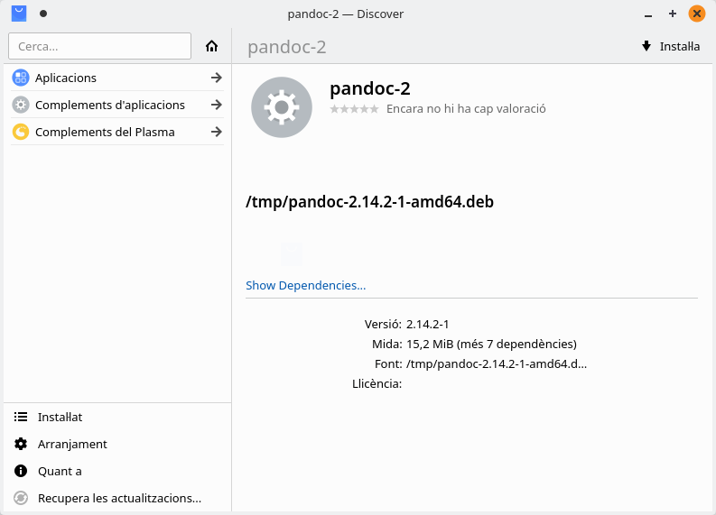
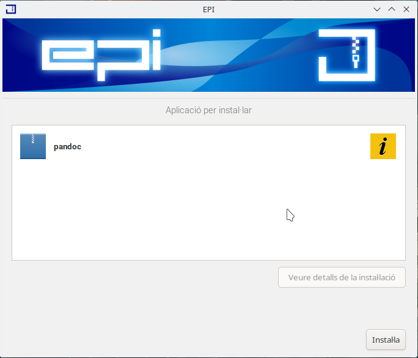
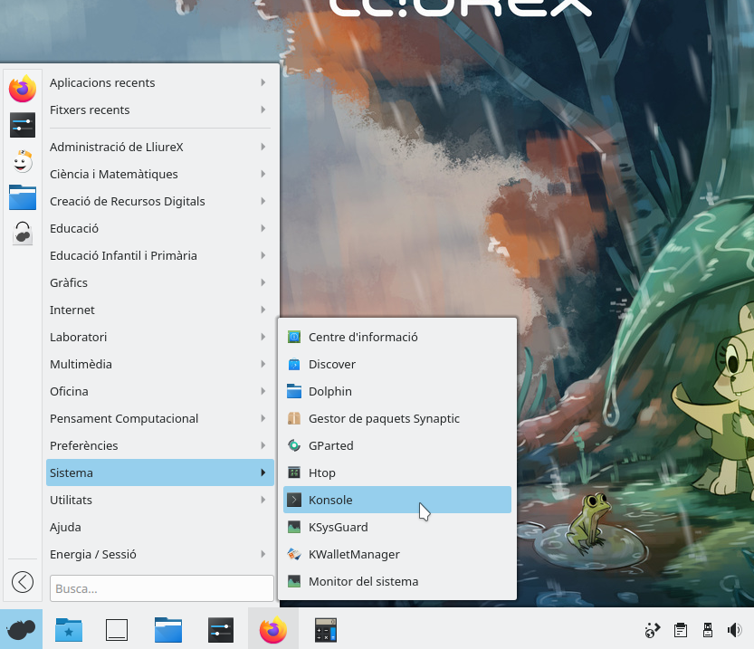
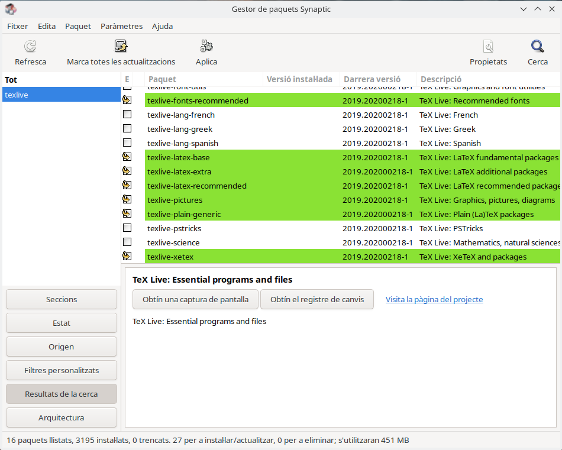

---
# Metainformació del document
title: Exportant a PDF
titlepage: true
subtitle: Introducció a Pandoc
author: 
- Ferran Cunyat
- Joan Gerard Camarena
- Jose Alfredo Murcia
lang: ca

# portada
titlepage-rule-height: 2
titlepage-rule-color: EE0000
titlepage-text-color: EE0000
titlepage-background: ./img/portada.png

# configuració de l'índex
toc-own-page: true
toc-title: Continguts
toc-depth: 2

# capçalera i peu
header-left: \thetitle
header-right: Curs 2021-2022
footer-left: CEFIRE València
footer-right: \thepage/\pageref{LastPage}

# Les figures que apareguen on les definim i centrades
float-placement-figure: H
caption-justification: centering 

# No volem numerar les linies de codi
listings-disable-line-numbers: true

# Configuracions dels paquets de latex
header-includes:

  #  imatges i subfigures
  - \usepackage{graphicx}
  - \usepackage{subfigure}
  - \usepackage{lastpage}


  #  - \usepackage{adjustbox}
  # marca d'aigua
  # - \usepackage{draftwatermark}
 # - \SetWatermarkText{\includegraphics{./img/Markdown.png}}
  #- \SetWatermarkText{Per revisar}
  #- \SetWatermarkScale{.5}
  #- \SetWatermarkAngle{20}
   
  # caixes d'avisos 
  - \usepackage{awesomebox}

  # text en columnes
  - \usepackage{multicol}
  - \setlength{\columnseprule}{1pt}
  - \setlength{\columnsep}{1em}

  # pàgines apaïsades
  - \usepackage{pdflscape}
  
  # per a permetre pandoc dins de blocs Latex
  - \newcommand{\hideFromPandoc}[1]{#1}
  - \hideFromPandoc {
      \let\Begin\begin
      \let\End\end
    }
 
# definició de les caixes d'avis
pandoc-latex-environment:
  noteblock: [note]
  tipblock: [tip]
  warningblock: [warning]
  cautionblock: [caution]
  importantblock: [important]
...

# Introducció

En aquesta unitat anem a veure principalment com exportar els documents que realitzem amb Markdown a altres formats, amb especial atenció al format PDF.

Segurament tots hem tingut contacte amb més d'un document en aquest format, i a grans trets, podem saber de què tracta. 

::: important
PDF significa *Portable Document Format*, i la idea principal que hi ha al darrere és oferir un format d'emmagatzemament i intercanvi de documents digitals que siga independent de les plataformes de programari i maquinari. 
:::

Es tracta d'un format compost, que combina tant text com imatge, ja siga en format de mapa de bits o vectorial. 

El format va ser desenvolupat inicialment per *Adobe Systems*, i es va convertir en un estàndard obert de forma oficial l'1 de julio de 2008, a través de la norma *ISO 32000-1* de l'Organització Internacional d'Estandardització (ISO).

Al llarg de la unitat, anem a treballar amb l'eina *Pandoc*, que ens ajudarà a realitzar aquesta conversió entre formats.

# Introducció a Pandoc

El programari Pandoc està format per un conjunt de programes que inclou una llibreria de funcionalitats, que realitzen la conversió entre fitxers de text amb diferents formats de marcat, junt amb una eina de la línia d'ordres que fa ús d'aquesta llibreria.

Entre els formats que és capaç de treballar Pandoc es troben Markdown, HTML, LaTeX, OpenDocument (Libreoffice), docx (Ms Word) o pdf.

Pandoc suporta una versió millorada de Markdown, que inclou sintaxi específica per a taules, llistes de definicions, blocs de dades, notes a peu de pàgina, cites o fòrmules matemàtiques entre d'altres.

El disseny de Pandoc és modular, i consisteix en un conjunt de lectors o *readers* i escriptors o *writers*.  Els lectors analitzen el text en un format i el reprodueixen internament, en una estructura jeràrquica (en forma d'arbre de sintaxi, anomenat també resum o AST). Per la seua banda, els escriptors converteixen aquesta representació jeràrquica en el format a què es vol convertir. D'aquesta manera, per tal de suportar un nou format d'entrada o eixida, només cal desenvolupar el lector o escriptor corresponent.

Existeixen formats d'entrada o eixida que són menys expressius que la representació interna que fa Pandoc, i per això no hem d'esperar conversions perfectes entre tots els formats (taules complexes, mides dels marges...). La millor manera d'assegurar una eixida tan perfecta com siga possible, és fent ús del Markdown propi de Pandoc.

{ width=300px }

# Instal·lació

Els repositoris de programari d'Ubuntu contenen el paquet `pandoc`, que podem instal·lar directament des de l'eina `apt` o el gestor de paquets del sistema.

Ubuntu 20.04 (i per tant LliureX 21) disposen d'un empaquetat propi de la versió 2.5 de Pandoc, que és de novembre de 2018. Si volem accedir a la última versió, la podrem descarregar a través de l'enllaç [https://github.com/jgm/pandoc/releases/latest](https://github.com/jgm/pandoc/releases/latest). En estos moments (octubre de 2021), la última versió disponible és la 2.14.2.

Per tal de descarregar esta última versió, només haurem de descarregar el paquet de programari corresponent al nostre sistema operatiu. Al nostre cas, per a Debian/Ubuntu/Lliurex de 64 bits descarregarem `pandoc-2.14.2-1-amd64.deb`.

Una vegada descarregat, tenim diverses opcions d'instal·lar-lo:

1. Fent doble clic en ell per tal que se'ns òbriga el gestor de programari del sistema (Discover, EPI, Ubuntu Software Center, etc.)

{ width=400px }

{ width=350px }

2. Fet ús de les eines d'instal·lació des de la línia d'ordres, com per exemple apt (tingueu en compte que caldrà iindicar la ruta cap al fitxer .deb que hajau descarregat):

```
$ sudo apt install ./pandoc-2.14.2-1-amd64.deb
```

::: caution
Al llarg d'aquesta unitat, veureu que anem a treballar molt amb la línia d'ordres. Per accedir a ella, ho farem des d'*Inici* > *Sistema* > *Konsole*:

{ width=400px }

Recordeu que quan fem referència a algun fitxer des de la línia d'ordres, hem d'estar ubicats a la mateixa carpeta que es troba el fitxer. Per a això cal que estigueu familiaritzatas una mica amb l'ús d'ordres com `cd`  (canviar carpeta) i `ls` (per sabe el contingut d'una carpeta).
:::


# Ús de Pandoc

Per tal d'utilitzar Pandoc, farem ús de l'eina de la línia d'ordres `pandoc`, instal·lada amb el paquet amb el mateix nom.

Tot i que l'ordre permet agafar l'entrada des del teclat i mostrar l'eixida per pantalla, la forma més habitual d'utilitzar-lo serà indicant un fitxer d'entrada i l'eixida, amb el paràmetre `-o`:

```bash
$ pandoc fitxerEntrada -o fitxerEixida
```

Aquesta ordre llig el fitxer `fitxerEntrada` i crea el fitxer `fitxerEixida`. Fixeu-vos que aquests noms de fitxers, com a tal, no tenen extensió. Si utilitzem directament aquesta ordre (i el fitxer `fitxerEntrada` existeix), obtindrme l'eixida:

```bash
[WARNING] Could not deduce format from file extension
  Defaulting to markdown
[WARNING] Could not deduce format from file extension
  Defaulting to html
```

Que ens indica que no pot deduir el format del fitxer a partir de l'extensió. El que fa en aquest cas és assumir que el format del fitxer d'entrada serà *markdown* i el d'eixida *html*.

Per tal d'evitar estes advertències, caldrà que els fitxers tinguen una extensió. Així, per exemple, sería més convenient fer:

```bash
pandoc fitxerEntrada.md -o fitxerEixida.html
```

Per defecte, `pandoc` produeix un fragment de document, no un document complet. Per tal de generar un fitxer HTML complet, amb el `<head>` i `<body>` caldrà utilitzar l'opció `-s`o `--standalone`:

```bash
$ pandoc fitxerEntrada.md -o fitxerEixida.html -s

[WARNING] This document format requires a nonempty <title> element.
  Defaulting to 'fitxerEntrada' as the title.
  To specify a title, use 'title' in metadata or --metadata title="...".

```

Amb això generarem l'HTML complet. L'advertència que ens apareix, es deu al fet que el document d'eixida necessita un títol. Això ho resolem incloent el camp `title` al bloc de metadades del fitxer, o des de la mateixa ordre, afegint, com s'indica `metadata title="títol de la pàgina"` en la línia d'ordres:

```bash
pandoc fitxerEntrada.md -o fitxerEixida.html -s --metadata title="Pàgina de prova"
```

## Concatenació de diversos fitxers

Pandoc permet especificar diferents fitxers d'entrada, de manera que els concatene amb línies en blanc entre ells abans de fer l'anàlisi. Si volem que s'analitzen individualment, haurem de d'afegir el flag `--file-scope`.

## Especificació de formats

Hem vist que *Pandoc* dedueix el format del fitxer a partir de l'extensió, però el format d'entrada també es pot especificar amb l'opció `-f` (*from*) i el d'eixida amb `-t` (*to*).

Per exemple, per fer la conversió anterior, faríem:

```bash
pandoc fitxerEntrada -o fitxerEixida -f markdown -t html
```

Per consultar els possibles formats d'entrada i d'eixida utilitzarem els flags `--list-input-formats` i `--list-output-format`.

```bash
pandoc --list-input-formats

pandoc --list-output-formats
```


# Creació d'eixides en PDF

La generació de fitxers pdf es realitza exactament igual que qualsevol altre tipus de fitxer, bé indicant l'extensió *.pdf* en el fitxer d'eixida, com indicant el paràmetre `-t pdf`:

```bash
pandoc fitxerEntrada.md -o fitxerEixida.pdf

pandoc fitxerEntrada.md -o fitxerEixida -t pdf
```

Ara bé, si llancem qualsevol de les dues ordres anteriors, obtindrem el següent missatge d'error:

```bash
pdflatex not found. Please select a different --pdf-engine or install pdflatex
```

Açò es deu al fet que Pandoc utilitza, de forma predeterminada, LaTeX per crear el PDF, i per tant, necessitem un motor LaTeX instal·lat al sistema.

::: tip

**Què és LaTeX?**

LaTeX és un sistema de composició de textos, orientat a la creació de documents escrits que presenten alta qualitat tipogràfica, i que és molt utilitzat en la generació de textos científics i tècnics.

Podeu trobar més informació sobre aquest sistema a la [Wikipèdia](https://es.wikipedia.org/wiki/LaTeX) o a [la pàgina del mateix projecte](https://www.latex-project.org/)

:::

A més de LaTeX, Pandoc pot generar documents pdf utilitzant altres motors, com per exemple *ConTeXt*, *roff ms* o *HTML*, que també caldiía instal·lar. Per tal d'indicar el motor de generació de PDF utilitzarem les opcions `-t format` o bé `--pdf-engine motor_pdf`.

Per exemple:

```
pandoc fitxerEntrada -o fitxerEixida.pdf  -f markdown -t html
```

Encara que açò també ens donaria l'error perquè necessitem el motor de *pdf* corresponent a HTML. Aquests motors estan disponibles generalment en els orígens de programari de qualsevol distribució GNU/Linux.

Veiem a les següents taules les possibilitats que tenim per tal de generar documents PDF bé amb l'opció `-t` o bé amb `--pdf-engine`:


| Motor de PDF | Opció per a Pandoc         | Paquet             |
|--------------|----------------------------|--------------------|
| LaTeX        | (per defecte) o `-t latex` | texlive-latex-base |
| HTML         |  `-t html`                 | wkhtmltopdf        |
| ConTeXt      |  `-t context`              | context            |
| Roff ms      |  `-t ms`                   | groff            |


A més, fent ús de l'opcó `--pdf-engine`, podem triar entre:

| Motor de PDF | Opció per a Pandoc         | Paquet             |
|--------------|----------------------------|--------------------|
| HTML         | `--pdf-engine wkhtmltopdf` | wkhtmltopdf        |
| Weasyprint   | `--pdf-engine weasyprint`  | weasyprint         |
| Prince       | `--pdf-engine prince`      | prince (des de [la seua web](https://www.princexml.com/download/)) |
| LaTeX |      | `--pdf-engine pdflatex`    | texlive-latex-base           |
| LuaLaTeX     | `--pdf-engine lualatex`    | texlive-latex-base           |
| XeLaTeX      | `--pdf-engine xelatex`     | texlive-xetex      |
| LaTeXmk      | `--pdf-engine latexmk`     | latexmk            |
| Tectonic     | `--pdf-engine tectonic`    | tectonic (des dels [repositoris de Github](https://github.com/tectonic-typesetting/tectonic/releases))          |
| Roff ms      | `--pdf-engine pdfroff`     | groff            |
| ConTeXt      | `--pdf-engine context`     | context            |


De moment, en aquest curs treballarem amb el motor de *LaTeX* per omissió i amb *XeLaTeX*, que és el motor que utilitzarem posteriorment per treballar amb plantilles de documents.

Per tal de fer la instal·lació d'aquests motors podem fer ús, des de la línia d'ordres de l'ordre `apt`, de la següent forma:

* Per al motor per omissió:

    ```bash
    sudo apt install texlive-latex-base
    ```

* Per a XeLaTeX:

```
sudo apt install texlive-xetex
```

També podem realitzar la instal·lació fent ús del gestor de paquets *Synaptic* (*Inici > Sistema > Gestor de paquets Synaptic*):

{ width=450px }

Amb açò, si *xelatex* és l'únic motor pdf instal·lat, no caldrà indicar res més, però si tenim diversos motors, caldrà indicar que volem utilitzar aquest amb `--pdf-engine`:

```bash
pandoc fitxerEntrada -o fitxerEixida.pdf  --pdf-engine xelatex
```

::: warning
**Package babel error**

Si no tenim cap idioma instal·lat, és possible que obtinguem un error en la conversió d'aquest tipus:

```bash
Error producing PDF.
! Package babel Error: Unknown option `catalan'. Either you misspelled it (babel) or the language definition file catalan.ldf was not found.
```

Per resoldre-ho, podem intal·lar el paquet `texlive-lang-spanish`, o `texlive-lang-all`, a través de la línia d'ordres o del maeteix Synapic.
:::


## Treballant amb plantilles

Pandoc permet treballar amb plantilles per a diversos tipus de documents (pdf, odt), que defineixen l'aspecte dels nostres documents.

Si genereu un document pdf, per defecte utilitza la plantilla *estàndard* d'aquest tipus de documents amb LaTex. No obstant això, podem indicar una altra plantilla amb l'opció --template:

```bash
pandoc fitxerEntrada -o fitxerEixida.pdf  --pdf-engine xelatex --template=nomPlantilla.latex
```

Disposeu de més informació sobre creació de plantilles a la [documentació de Pandoc](https://pandoc.org/MANUAL.html#templates).

Al nostre cas, fem ús de la [plantilla Eisvogel](https://github.com/Wandmalfarbe/pandoc-latex-template). 

Per descarregar la plantilla, accedim a l'enllaç, i fem click al botó *Code*, per seleccionar l'opció *Download ZIP*. Si teniu coneixements de Git i Github, podeu clonar també el repositori. 

{ width=300px }

Una vegada descarregada, la descomprimim a una carpeta, i la referenciem amb `--template` mitjançant la ruta relativa, quan volguem utilitzar-la. Per exemple, si tenim la següent organització de carpetes:

```bash
Documents/
├── Document1.md
├── pandoc-latex-template-master
│   ├── CHANGELOG.md
│   ├── docs
│   ├── eisvogel.tex
│   ├── examples
│   ├── icon.png
│   ├── icon.svg
│   ├── LICENSE
│   ├── README.md
│   └── tools
```

I estem ubicats a la carpeta *Documents*, per afegit la plantilla a la conversió farem:

```bash
pandoc Document.md -o Document.pdf --pdf-engine=xelatex --template=pandoc-latex-template-master/eisvogel.tex
```