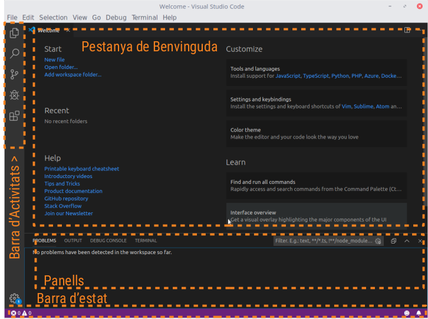

# Guia ràpida de VSCode

Existeixen diversos editors especialitzatsa en Markdown, tant via web (Dillinger, Draft o Stackedit) com d'escriptori (Typora, Dillinger, WriteMonkey o Haroopad).

No obstant això, l'opció més interessant, ja que el solem utilitzar també com a editor de codi, és fer ús de Visual Studio Code.

Per instal·lar-lo tenim dos opcions:

1. Descarregar-lo directament des de la web (https://code.visualstudio.com/download) i instal·lar-lo (això ens afegirà també els sources de Microsoft, per a les actualitzacions)
2. Afegir el pps de MS. Per a això:
    *. Obtenim la clau GPG amb la que estan signats els paquets de MS i la incorporem al sistema (si no tenim instal·lat prèviament el paquet `curl` caldrà instal·lar-lo amb `sudo apt-get install curl`):

    ```sh
    $ curl https://packages.microsoft.com/keys/microsoft.asc | gpg --dearmor > packages.microsoft.gpg
    $ sudo install -o root -g root -m 644 packages.microsoft.gpg /usr/share/keyrings/
    ```

    2. Creem el fitxer vscode.list dins la carpeta de fonts de programari del sistema amb la línia referent al repositori de VSCode:

```shell 
$ sudo sh -c 'echo "deb [arch=amd64] https://packages.microsoft.com/repos/vscode stable main" > /etc/apt/sources.list.d/vscode.list'
$ sudo sh -c 'echo "deb [arch=amd64 signed-by=/usr/share/keyrings/packages.microsoft.gpg] https://packages.microsoft.com/repos/vscode stable main" > /etc/apt/sources.list.d/vscode.list'
```

    3. Actualitzem la memòria caché de paquets i instal·lem VSCode amb:

    ```shell
    $ sudo apt-get install apt-transport-https
    $ sudo apt-get update
    $ sudo apt-get install code
    ```

Si feu ús de Justix (https://ieseljust.github.io/Bionic/), ja disposeu de VSCode instal·lat per defecte amb el metapaquet justix-devel-pack-*.

Per a més informació, disposeu de la documentació oficial sobre la instal·lació en Linux i Windows en:

* [https://code.visualstudio.com/docs/setup/linux](https://code.visualstudio.com/docs/setup/linux)
* [https://code.visualstudio.com/docs/setup/windows](https://code.visualstudio.com/docs/setup/windows)


## Presa de contacte amb VSCode

Una vegada instal·lat, tenim el Visual Studio Code accessible des del menú principal del sistema, dins de *Programació*.

Quan l'obrim, veurem una interfície semblant a la següent:

{ width=450px }

* La **barra d'activitats**, situada a l'esquerra, amb cinc activitats principals: L'**explorador de fitxers**, la de **Búsqueda de text**, la de **control de versions amb Git**, la de **depuració**, i la d'**extensions.** Cadascuna d'aquestes activitats, ens obrirà una altra barra lateral al costat amb les diferents possibilitats que ofereix l'activitat.
* La **finestra de benvinguda**, situada a la part principal de l'editor, que ocupa la part superior, i que ens ofereix algunes **opcions d'inici** com crear un fitxer nou, obrir una carpeta o afegir un espai de treball. A més, disposem també d'una secció de **fitxers recents**, inicialment buida, i de diversos **opcions de personalització**, com extensions per suportar alters llenguatges, dreceres de teclat, i temàtica de l'editor. En aquesta finestra, també disposem d'algunes opcions d'**Ajuda**, i alguns tips per aprendre, com la llista d'ordres o una ullada a la interfície.
* Diversos **panells**, situats al davall de la finestra principal de l'editor, i que mostraran informació sobre la depuració, errors, avisos, o bé la terminal integrada a VSCode.
* A la part inferior, distingim finalment la barra d'estat, amb informació sobre el projecte i els fitxers oberts.

A les últimes versions, quan obrim una carpeta nova, també ens demana que confirmem si *confiem* en qui ha fet el codi que hi ha en aquesta carpeta:

{ width=450px }

Disposeu de més informació sobre la interfície de VSCode en:

* [https://code.visualstudio.com/docs/getstarted/userinterface](https://code.visualstudio.com/docs/getstarted/userinterface)


## Instal·lació de plugins en VSCode

VSCode és un editor lleuger, i alhora extremadament flexible mitjançant plugins. A banda de suportar altres llenguatges de programació, també ens permet extensions, per treballar, per exemple amb el llenguatge Markdown.

Per a això, fem clic a l'**activitat d'extensions**, ubicada cap a la part inferior de la barra d'activitats, i al quadre de cerca d'extensions escrivim *Markdown*.

{ width=450px }

>
> **NOTA**
>
> Amb les últimes versions de VSCode, no necessitem en principi cap extensió per treballar amb la sintaxi de Markdown, ni per previsualitza aquest.
>

Veurem que ens apareix gran quantitat d'extensions per a Markdown. Podeu donar un cop d'ull a totes elles, però de moment, podem instal·lar l'extensió `markdownlint`, que ens ajuda a comprovar la correcta sintaxi del codi Markdown i ens ofereix la possibilitat de previsualitzar el resultat al temps que escrivim. Per a això, només haurem de **fer click en el botó `Install` que apareix bé al costat de l'extensió o en la descripció d'aquesta`. Si ho desitgeu, podeu instal·lar també l'extensió *Markdown PDF* que us permet guardar els fitxers creats en format *md* a *pdf*.

Per tal de començar a treballar amb algun exemple, podem anar a l'activitat de *l'Explorador de fitxers* i prémer el botó *Open Folder* per tal d'obrir una carpeta de treball, o fer-ho directament a través del menú *File > Open Folder*.

Així doncs, obriu la carpeta on teníeu la primera pràctica i carregueu el fitxer en format Markdown que vàreu realitzar. Comproveu si el VSCode us detecta alguna incorrecció i quines suggerències us fa per corregir-les. Fixeu-vos també en què ha aparegut una icona a la part superior dreta de la finestra d'edició, amb una lupa davant una finestra, que ens serivrà per dividir la vista de l'editor i veure a la part dreta el resultat del què estem escrivint en Markdown.

Per altra banda, doneu una ullada a les possibilitats que ens ofereix el gestor de fitxers: navegar per la carpeta, buscar fitxers o carpetes,i crear tant fitxers com carpetes noves dins l'estructura en la què estem.


